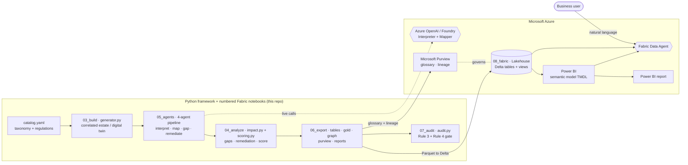

# Regulatory Change Impact Intelligence Framework — Azure POC

A generic, data-driven framework that ingests an **incoming regulatory change** and
produces an **impact + gap assessment** across a bank's controls, capabilities,
technologies, evidence, systems, business processes, products and data — then **scores
compliance before and after** the change and recommends **remediation** to close each
gap.

Because no real systems are available, the framework generates a **fully correlated
synthetic bank estate** (a *digital twin* — referential integrity maintained as an
explicit relationship graph) so the analysis is realistic and easy to demo. The data is
shaped to land in **Microsoft Fabric**, be queried in natural language by a **Fabric
Data Agent**, reasoned over by **agents on Azure OpenAI**, and governed by **Microsoft
Purview**.

> **Reference docs.** This README covers the **business context, an overview of what we
> are trying to do, and a summary of the technical architecture**. The **technical demo
> talk track and how to build & run the demo** live in
> [`demodocbuild.md`](demodocbuild.md). Running change history is in
> [`changedoc.md`](changedoc.md); key decisions in [`decisions.md`](decisions.md).

---

## What we are trying to do

Build a **generic, reusable framework** that takes an **incoming regulatory change** and
produces an **impact + gap assessment** across a bank's controls, capabilities,
technologies, evidence, systems, processes, products and data — then **scores compliance
before and after** the change and recommends **remediation**. The framework is built on
**Azure data + AI services** (Microsoft Fabric, Microsoft Purview, Azure OpenAI /
Foundry, Fabric Data Agent) and is designed to generalise to *any* regulation, not a
single hard-coded one.

It is intentionally **Foundry/Fabric-first**: the agent workflow is expected to use
Microsoft Agent Framework, Azure AI Foundry, and Fabric Data Agent rather than masking
cloud configuration issues with local fallback behavior.

## Business outcomes

| Outcome | Description |
| --- | --- |
| Faster impact assessment | Turn a regulatory change into a quantified gap/impact view in minutes, not weeks. |
| Provable compliance | Move from "we claim we comply" to "we can evidence it" via the Evidence layer. |
| Board-level narrative | A compliance score with a clear **As-is → Post-change (dip) → Post-remediation (recovery)** story. |
| Prioritised remediation | Costed, owner-assigned actions ranked by severity and criticality. |
| Generic & extensible | Add any regulation by editing the catalog or uploading regulation text — no code change. |
| Trust & governance | Lineage + glossary in Microsoft Purview; natural-language Q&A via Fabric Data Agent. |

**Primary audience:** Financial Services (bank) — Risk, Compliance, Data Governance and
the CDO/CISO office.

## Scope — regulations covered out of the box

EU AI Act, NIST AI RMF, DORA, Basel, BCBS 239, GDPR, PSD2, Consumer Duty, FCA
Operational Resilience, SEC, OCC, MAS, AMLD (13 total). Extensible via
[`src/regimpact/catalog.yaml`](src/regimpact/catalog.yaml) or the Regulation Interpreter
agent.

## How it works (overview)

### The five-layer model

The framework models compliance as five correlated layers, so a change can be traced
from the law all the way down to the artefact that proves you comply:

| Layer | What it is | Entities |
| --- | --- | --- |
| 1. Regulation | the law and what it requires | `regulations`, `regulatory_changes`, `obligations` |
| 2. Control | how the bank responds | `controls` (+ control families) |
| 3. Capability | the compliance capability a control realises | `capabilities` |
| 4. Technology | the platform/tool that enables the capability | `technologies` |
| 5. Evidence | the artefact that proves the control operates | `evidence` |

A **gap** is raised when a control is too immature **or** when it is mature but its
evidence is Missing/Partial/Stale — i.e. compliance cannot be *proven*.

### The four agents

Mirroring the analyst workflow, four cooperating agents run the assessment through
the Foundry/Fabric agentic architecture. Foundry or Fabric configuration failures
should surface explicitly so they can be fixed instead of hidden by local fallback logic.

| Agent | Input → Output |
| --- | --- |
| 1. Regulation Interpreter | regulation text → structured obligations |
| 2. Control Mapper | obligations → required controls / capabilities |
| 3. Gap Analysis | current state → gaps (maturity + evidence) |
| 4. Remediation | gaps → prioritised, costed remediation plan |

### Compliance scoring (the before/after story)

Every change is scored 0–100 across three scenarios so you can tell the board-level
narrative: **As-is** (baseline) → **Post-change** (the new obligation exposes the gap,
score dips) → **Post-remediation** (after the recommended actions, score recovers).

### Why this is generic

You extend it to *any* regulation by editing one file —
[`src/regimpact/catalog.yaml`](src/regimpact/catalog.yaml) — or by uploading raw
regulation text to the **Regulation Interpreter** agent. Add a regulation with
obligation templates that reference existing capability *themes*; the generator, impact
engine and scorer need **no code changes**. Themes are the join that keeps every
requirement traceable to concrete controls, capabilities, technologies and evidence.

## Technical architecture (summary)

The pipeline runs as a Python framework (also packaged as numbered Fabric notebooks): a
seed catalog builds a correlated synthetic estate, four agents interpret and map the
change, an impact + scoring engine raises gaps and scores compliance, and the results
are exported to tables, a graph, a Gold star schema, Purview assets and reports. The
exports land in **Microsoft Fabric** (Delta tables + a Power BI semantic model), are
queried in natural language by a **Fabric Data Agent**, and are governed by **Microsoft
Purview**.

**Mermaid source (architecture)**

Every relationship in the estate is an explicit, **typed edge**, so the same data is
simultaneously **tabular** and a **graph** — this is what makes impact traceable end to
end. The detailed data model, the worked example and the build steps are in
[`demodocbuild.md`](demodocbuild.md).

### End goal: agents over an ontology / semantic model

The end goal is **agents supported by an ontology and/or semantic models**. The platform
supports this: a Fabric Data Agent can use up to **five data sources** including
lakehouses, warehouses, Power BI **semantic models**, KQL databases, **ontologies**, and
Microsoft Graph. The typed-edge model in this POC is the precursor to that ontology.

## Where to go next

- **Build & run the demo**, the demo talk track, notebook run order and Fabric setup → [`demodocbuild.md`](demodocbuild.md).
- **Change history** → [`changedoc.md`](changedoc.md); **key decisions** → [`decisions.md`](decisions.md).
