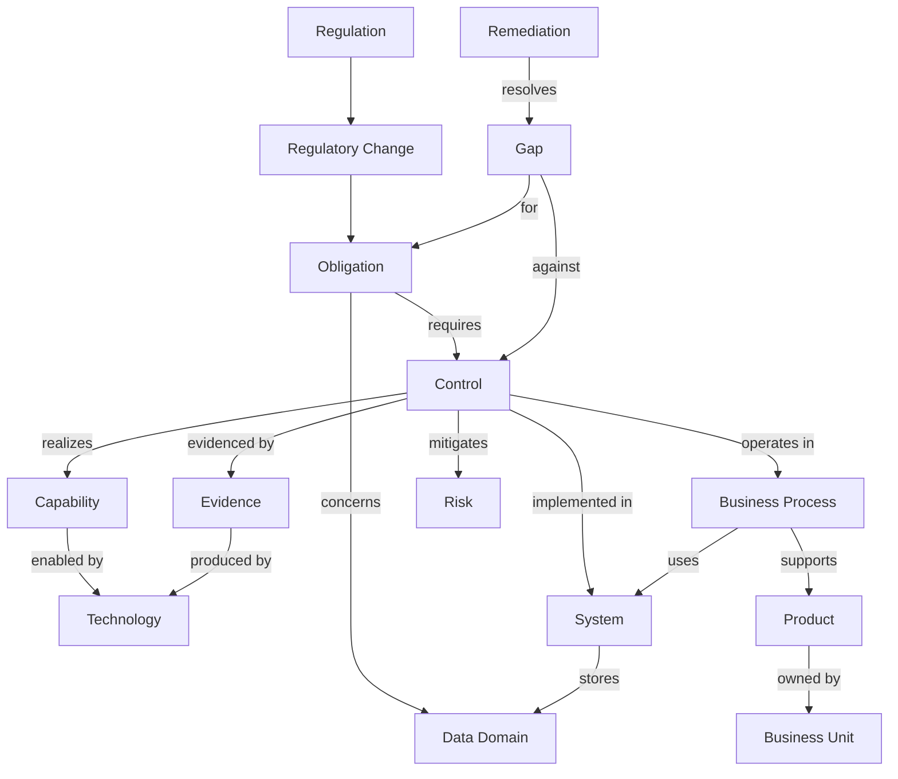

# Regulatory Change Impact Intelligence Framework — Demo Build & Talk Track

> **Status:** Living reference document. Last updated **2026-07-02**. This file is the
> **technical demo talk track and how to build & run the demo**, plus the demo-related
> technical detail. The **business context, overview and a summary of the technical
> architecture** live in [`README.md`](README.md). Running change history is in
> [`changedoc.md`](changedoc.md); key decisions in [`decisions.md`](decisions.md). "Update
> the reference docs" = update all of them.

---

## 1. Demo narrative (5-minute talk track)

1. `python -m regimpact list-changes` — "here are the incoming regulations".
2. `python -m regimpact interpret --file data/regulations/eu_ai_act_high_risk.txt --regulation REG-AIACT --name "EU AI Act" --title "High-risk AI update"` — the **agents** read the regulation, map controls, find gaps and score it.
3. `python -m regimpact score --change CHG-DORA` — show the compliance score **dip** when the change lands and the **recovery** after remediation.
4. Open `output/reports/impact_CHG-DORA.md` — the board-ready read-out.
5. In Fabric, ask the **Data Agent**: *"Which products are affected by the DORA change and what should we do first?"* and *"Which capability is weakest and what technology enables it?"* — the maintained relationships answer in plain English.
6. Show **Purview** lineage: *"Customer PII flows into these obligations"* — the governance/trust story.

## 2. Quick start (developer POC)

```powershell
python -m venv .venv
.\.venv\Scripts\Activate.ps1
pip install -r requirements.txt

$env:PYTHONPATH = "src"
python -m regimpact list-changes          # see incoming changes
python -m regimpact analyze --change CHG-DORA
python -m regimpact score   --change CHG-DORA   # before/after compliance score
python -m regimpact interpret --file data/regulations/eu_ai_act_high_risk.txt `
    --regulation REG-AIACT --name "EU AI Act" --title "High-risk AI update"
python -m regimpact demo                   # generate + analyse all + score + export
python -m regimpact gold                   # Gold star schema (dims + facts) for the semantic model
python -m regimpact audit                  # data-type (Rule 3) + referential-integrity (Rule 4) audit
```

The agents are intended to run through the Foundry/Fabric agentic path. Live Azure
OpenAI or Foundry integration must use Microsoft Entra authentication with
`AZURE_OPENAI_ENDPOINT` and `AZURE_OPENAI_DEPLOYMENT`; API-key authentication is
intentionally unsupported.

Outputs land under `output/`:

| Folder | Contents | Used by |
| --- | --- | --- |
| `output/tables/` | `*.parquet` + `*.csv` per entity (incl. capabilities, technologies, evidence, compliance_scores), plus `relationships.*` | Fabric Lakehouse / Power BI |
| `output/gold/` | Gold star-schema dims + facts (`*.parquet`) | Power BI semantic model |
| `output/graph/` | `estate.graphml`, `estate.json` | Graph viz (Gephi, D3, Cytoscape) |
| `output/reports/` | `impact_<change>.md` | Stakeholder read-outs |
| `output/purview/` | `glossary_terms.json`, `lineage.csv` | Microsoft Purview |

## 3. Worked example — follow one change through the data flow

This traces a single real chain from the generated DORA analysis, so you can see exactly
how one obligation becomes a gap, a remediation and a score movement.


| # | Layer / stage | What happens | Concrete value (this run) |
| --- | --- | --- | --- |
| 1 | Regulation | The law in scope | `REG-DORA` |
| 2 | Change | An incoming update lands | `CHG-DORA` — Critical, effective 2027-04-15 |
| 3 | Obligation | Atomic requirement of the change | `OBL-DORA-01`, theme `ICT_RESILIENCE`, **target maturity 4** |
| 4 | Control | The bank's responding control | `CTL-OR-3` ICT Continuity & Recovery — **as-is maturity 1**, owner `BU-OPS` |
| 5 | Capability | What the control realises | `CAP-RES` Operational Resilience |
| 6 | Technology | What enables the capability | ServiceNow |
| 7 | Evidence | The artefact that would prove it | `EV-BCP` — status **Missing** |
| 8 | Gap | Shortfall is raised | `GAP-OBL-DORA-01-CTL-OR-3` — **Critical**, shortfall 3 (target 4 − maturity 1); Missing evidence compounds it |
| 9 | Remediation | Costed, owned fix | Uplift the control — **110 person-days**, owner `BU-OPS`, priority Critical |
| 10 | Score | Board-level before/after | As-is **54.8%** → Post-change **53.3%** → Post-remediation **59.6%** |

**Reading it:** the obligation demands maturity 4, but `CTL-OR-3` sits at maturity 1
*and* its business-continuity evidence (`EV-BCP`) is Missing — so the engine raises a
Critical gap, attaches a 110-day remediation, and the compliance score dips when the
change lands (54.8 → 53.3) then recovers above baseline once remediation is applied (→
59.6). Every arrow is a typed edge in the `relationships` table, so the same chain is
queryable as both tables and a graph.

## 4. The correlated data model

Every relationship is an explicit, typed edge — this is what makes impact traceable and
the demo compelling.


**Mermaid source (data model)**



**Correlation backbone (why the demo joins cleanly):** `obligation.theme →
control_families → controls`; `control.family → capability`; `capability →
technologies`; `control.family → evidence`; `control → systems → processes → products →
units`. Every relationship is an explicit **typed edge** (`relationships` table), so the
data is simultaneously **tabular** and a **graph**.

**How a gap is found:** each obligation has a `target_maturity`; each control has an as-
is `maturity` (0–5) and a set of `evidence` artefacts. Where a required control falls
short on maturity *or* evidence, a `Gap` is raised with severity (escalated by
obligation criticality), its blast radius (systems/processes/products/data), and a
costed `RemediationAction`.

## 5. Project layout

```
config/settings.py              configuration (seed, paths, Azure OpenAI)
data/regulations/               sample regulation text for the Interpreter agent
src/regimpact/
  catalog.yaml                  bank taxonomy + 5 layers + regulations (extend here)
  models.py                     entity + relationship (edge) models
  generator.py                  builds the correlated estate (digital twin)
  impact.py                     gap + remediation engine (maturity + evidence)
  scoring.py                    compliance scoring (as-is / post-change / post-remediation)
  graph.py                      NetworkX graph builder
  export.py                     tables / graph / report export
  purview.py                    glossary + lineage export
  cli.py                        command-line interface
  agents/                       4-agent pipeline (Foundry/Fabric agentic path)
fabric/                         Lakehouse load notebook + Data Agent grounding
purview/                        Purview governance guidance
```

## 6. Run as Fabric notebooks (manual, cell by cell)

The same pipeline is also packaged as **numbered notebooks** you execute **in folder
order, cell by cell**. Each notebook documents every runnable cell with a markdown step
above it, and is self-contained (it rebuilds the seeded estate), so you can run them
independently. The `regimpact` package in `src/` stays the importable engine — the
notebooks call into it.

```
01_setup/    01 install_dependencies · 02 configure_environment
02_inputs/   01 explore_catalog · 02 explore_regulation_documents
03_build/    01 generate_estate
04_analyze/  01 impact_gap_analysis · 02 compliance_scoring
05_agents/   01 run_agent_pipeline · 02 interpret_uploaded_regulation
06_export/   01 entity_tables · 02 gold_star_schema · 03 graph · 04 purview_assets · 05 impact_reports
07_audit/    01 audit_data_quality
08_fabric/   01 load_lakehouse (PySpark) · 02 publish_semantic_model_and_data_agent
```

> **Why the bootstrap cell is in every notebook:** each notebook runs in its own kernel
> (locally and in Fabric), so `sys.path` set in one notebook is not visible to the next.
> The bootstrap cell makes each notebook standalone and is the single place to hard-set
> `ROOT` on Fabric if auto-detection fails. Keep it.

### 6.1 Demo run sheet

Run the notebooks **in folder order, top to bottom, one cell at a time**. This is the
dependency order. For a first run you can skip the *optional* stages and still get a
complete, audited demo.

| Order | Notebook | What it does | Required? |
| --- | --- | --- | --- |
| 1 | `01_setup/01_install_dependencies` | Installs Python packages | Once per environment |
| 2 | `01_setup/02_configure_environment` | Confirms root resolves; prints settings | ✅ |
| 3 | `02_inputs/01_explore_catalog` | Shows the seed catalog | Optional (narrative) |
| 4 | `02_inputs/02_explore_regulation_documents` | Shows raw regulation text | Optional (narrative) |
| 5 | `03_build/01_generate_estate` | Builds the correlated synthetic estate | ✅ **core** |
| 6 | `04_analyze/01_impact_gap_analysis` | Impact + gap detection | ✅ |
| 7 | `04_analyze/02_compliance_scoring` | As-is / post-change / post-remediation scores | ✅ |
| 8 | `05_agents/01_run_agent_pipeline` | 4-agent pipeline | Optional (needs LLM) |
| 9 | `05_agents/02_interpret_uploaded_regulation` | Interpret a newly uploaded regulation | Optional (needs LLM) |
| 10 | `06_export/01…05` | Entity tables → gold → graph → Purview → reports | ✅ |
| 11 | `07_audit/01_audit_data_quality` | Integrity audit (expect 122/122 PASS) | ✅ |
| 12 | `08_fabric/01_load_lakehouse` | Load Parquet into the Lakehouse (PySpark) | Fabric only |
| 13 | `08_fabric/02_publish_semantic_model_and_data_agent` | Publish model + Data Agent | Fabric only |

**Recommended first run:** `1 → 2 → 5 → 6 → 7 → 10 → 11`. That builds the estate, finds
gaps, computes scores, exports every output and proves integrity — no LLM key or Fabric
workspace needed. Add stages 3–4, 8–9 and 12–13 once the core run is green.

## 7. Running inside a Microsoft Fabric workspace

### 7.1 What Git syncs vs. what you import/clone

Fabric Git integration only materialises folders that are **Fabric items** (a folder
containing a `.platform` file). Everything else in the repo is invisible to the
workspace. So the repo is split across two delivery mechanisms:

| Repo content | Is it a Fabric item? | How it gets into Fabric |
| --- | --- | --- |
| `fabric/semantic_model/RegImpact.SemanticModel/` | ✅ yes | **Git** (Update) |
| `**/*.Notebook/` (generated notebook items) | ✅ yes | **Git** (Update) |
| `src/`, `config/`, `data/` (the `regimpact` engine) | ❌ no | **clone into Lakehouse `Files/`** |
| `*.ipynb`, `diagrams/`, `output/`, docs | ❌ no | not synced (local-only source) |

> The plain `.ipynb` files stay as the **editable source** for local VS Code work. The
> Fabric-runnable copies are the generated `*.Notebook/` items.

### 7.2 Bulk-import the notebooks (preserving the folder structure) via Git

Each `.ipynb` has a matching Fabric **notebook item** (`<name>.Notebook/` with a
`.platform` + `notebook-content.py`) generated alongside it. Because each item sits in
its numbered folder, a single Git **Update** recreates the whole `01_setup … 08_fabric`
tree as workspace folders — no one-by-one upload.

Workflow whenever you change a notebook:

```powershell
# 1. edit the .ipynb locally, then regenerate the Fabric items
.\.venv\Scripts\python.exe tools\build_fabric_items.py
# 2. commit + push
git add .
git commit -m "Update notebooks"
git push
```

Then in Fabric: **Source control → Update**. All 17 notebooks appear under their
numbered workspace folders.

> `tools/build_fabric_items.py` uses a deterministic `logicalId` per notebook, so re-
> running and re-syncing **updates** the same items instead of creating duplicates.

### 7.3 Clone the engine into the Lakehouse `Files/`

Git won't place `src/`, `config/`, `data/` into the Lakehouse, so the first setup
notebook (`01_setup/01_install_dependencies`) includes a **Fabric-only clone cell** that
runs:

```python
git clone https://github.com/muthukr1/RegulatoryChange /lakehouse/default/Files/RegulatoryChange
```

It is skipped automatically when running locally and re-pulls if already present.

### 7.4 Make the bootstrap find the code

Auto-detection walks up from the notebook's working directory looking for
`src/regimpact` + `config/`. If that fails on Fabric, set `ROOT` explicitly in the
bootstrap cell:

```python
ROOT = Path('/lakehouse/default/Files/RegulatoryChange')
```

### 7.5 Lakehouse is workspace-only — don't let Git overwrite it

Create the Lakehouse as a **workspace item** (New → Lakehouse). Its **data is never in
Git** (only metadata can be), so keep it out of the sync scope. When the initial Git
connection asks for a sync direction with both sides populated, choose the direction
that **keeps** workspace items — letting Git overwrite the workspace can delete an
untracked Lakehouse, and there is no item-level recycle bin to restore it.

### 7.6 Run order on Fabric

Notebooks `01`–`07` run on a standard Python notebook attached to the Lakehouse.
Notebook `08_fabric/01_load_lakehouse` must run on a **Spark** notebook attached to the
Lakehouse (it uses the Fabric-provided `spark` session) — upload
`output/tables/*.parquet` to `Files/regimpact_raw/` and `output/gold/*.parquet` to
`Files/regimpact_gold/` first, then *Run all*. Finally follow
`08_fabric/02_publish_semantic_model_and_data_agent` to publish the model and Data
Agent.

## 8. Taking it to Azure

1. **Fabric** — create a Lakehouse, upload `output/tables/*.parquet`, run [`fabric/notebook_load_lakehouse.py`](fabric/notebook_load_lakehouse.py) to create Delta tables + the `v_impact`, `v_compliance` and `v_capability_health` views.
2. **Data Agent** — create a Fabric Data Agent over the Lakehouse and paste the grounding from [`fabric/data_agent_instructions.md`](fabric/data_agent_instructions.md); add the example questions from [`fabric/data_agent_example_questions.md`](fabric/data_agent_example_questions.md).
3. **Azure OpenAI / Foundry** — use Microsoft Entra authentication only. Set `AZURE_OPENAI_ENDPOINT` and `AZURE_OPENAI_DEPLOYMENT` for live integration; do not hide missing or failing Foundry/Fabric configuration behind local fallback behavior.
4. **Purview** — import the glossary and lineage per [`purview/README.md`](purview/README.md).

## 9. Verified platform constraints (current as of 2026-06-25)

These are **verified from Microsoft Learn** and directly shape the demo:

- **Fabric Data Agent is GA**, uses Azure OpenAI Assistant APIs, read-only, generates NL2SQL / NL2DAX / NL2KQL. Requires **F2+ Fabric capacity**.
- It queries **lakehouse *tables*, not standalone files** (CSV/JSON must be ingested/exposed as tables) and **does not support unstructured data** (.pdf/.docx/.txt). → Our pipeline loads Parquet into **managed Delta tables**, so it is compliant.
- Supports **up to 5 data sources**; **ontologies and semantic models are valid sources** (aligns with our end goal).
- Responses are capped at **25 rows × 25 columns** and English-only.
- Respects **Microsoft Purview** DLP and access-restriction policies.

## 10. Audit items

1. **Data-type uniformity (Rule 3) — VERIFIED 2026-06-25.** An automated audit ([`src/regimpact/audit.py`](src/regimpact/audit.py)) reads every exported Parquet file and proves each logical column has the **same physical dtype** everywhere it appears, and that key/numeric/bool columns match their expected family (all `id`/`*_id`/`*_ids` are strings, `maturity`/`target_maturity`/ `maturity_shortfall`/`estimated_effort_days` are ints, `score`/`weight` are floats, `contains_pii`/`is_microsoft` are bools). **Result: 87/87 PASS.**
2. **Referential integrity (Rule 4) — VERIFIED 2026-06-25.** The same audit validates primary-key uniqueness on all 15 entity tables and every foreign key — including list-valued keys (`affected_*_ids`) and **all 1,135 typed edge endpoints** — against the in-memory estate. **Result: 35/35 PASS, zero orphan/stale keys.**
3. **Semantic model (GA) — BUILT 2026-06-25.** A Gold star schema ([`src/regimpact/gold.py`](src/regimpact/gold.py) → `output/gold/`, 13 dims + 3 facts + 1 bridge) feeds a source-controlled **Power BI semantic model** (TMDL) at [`fabric/semantic_model/RegImpact.SemanticModel`](fabric/semantic_model/RegImpact.SemanticModel) with the before/after score measures. Star fact→dimension integrity validated.
4. **Ontology (preview) — DOCUMENTED 2026-06-25.** Digital Twin Builder is in preview; our typed-edge model maps 1:1 to its entity/relationship types — see [`fabric/ontology_mapping.md`](fabric/ontology_mapping.md). Build it when the preview is adopted.

Run the audit any time with:

```powershell
$env:PYTHONPATH = "src"
.\.venv\Scripts\python.exe -m regimpact audit   # exits non-zero if anything fails
```

> Items 1 and 2 are closed (logged in `changedoc.md` / `decisions.md`). The demo is
> **data-type clean and joinable end to end**. Item 3 (semantic model) is built (GA); item
> 4 (ontology) is documented and staged on the preview.

## 11. References (verified 2026-06-25)

- Fabric Data Agent (concept): https://learn.microsoft.com/en-us/fabric/data-science/concept-data-agent
- Foundry / Azure OpenAI models: https://learn.microsoft.com/en-us/azure/foundry/foundry-models/concepts/models-sold-directly-by-azure
- Microsoft Purview (hub): https://learn.microsoft.com/en-us/purview/
- Microsoft Purview Unified Catalog: https://learn.microsoft.com/en-us/purview/unified-catalog
- Microsoft Purview Data Map: https://learn.microsoft.com/en-us/purview/data-map
